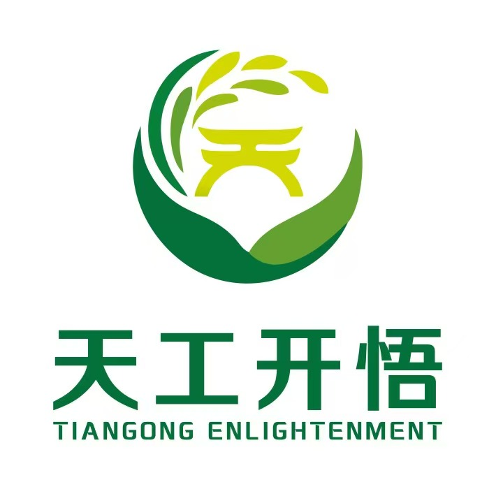
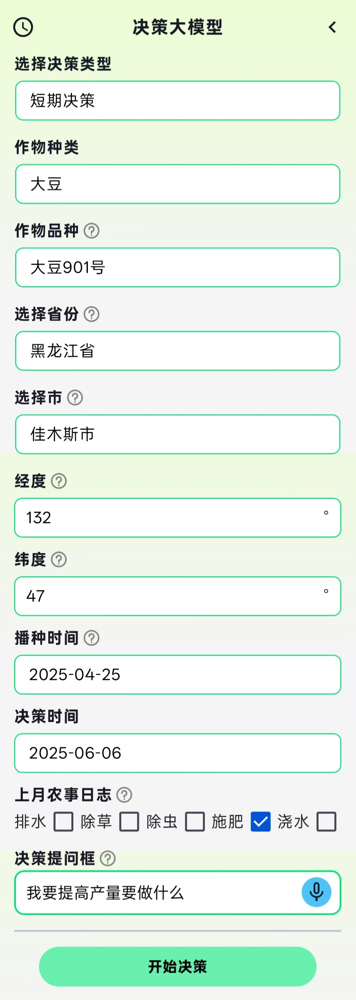
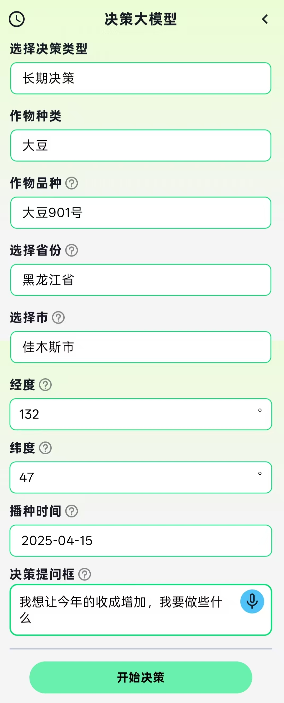

</img> 

# 🌾农业决策大模型

> **天工不遗，以配万物；开悟不止，以成百谷。**

## 🤖模型简介

本项目旨在为农业生产提供智能化农事管理决策支持。模型结合作物生长阶段、气象数据和历史经验，自动生成**结构化农事管理报告**。  
支持两类核心功能：  
- **短期农事决策**（约 1 个月）：结合未来天气预报，输出播种、灌溉、施肥、防治等近期操作建议。  
- **长期农事决策**（从播种到成熟）：结合去年实况与今年预估气候，对比生长进程，生成逐月必做/可选农事安排，并给出产量效果与预估。  

## ⚙️模型结构
- 在开源基模型**Qwen3-8B**的基础上进行结构优化。
- 通过**全参微调**实现**短期农事决策**和**长期农事决策**。

## 🌤短期农事决策

### 📘功能简介
短期决策聚焦于 **本月的** 的农事安排。    

报告内容包括：
1. **阶段分析**：根据气象条件与生长阶段，评估作物的总体生长状况和潜在风险。  
2. **月度农事安排**：分为“必做项”和“可选项”，并对每项操作标注类别（水/肥/药/农机）、时间区间与操作目的。  

### 🎬模型使用演示

1️⃣输入要种植的**作物种类**

2️⃣输入要种植的**作物品种**

3️⃣选择种植区域的**省市地区**

4️⃣输入种植地点的**经纬度**

5️⃣选择**播种时间**与**决策时间**

6️⃣选择**上月农事日志**(包含：`排水`,`除草`,`除虫`,`施肥`,`浇水`)

7️⃣输入**决策提问**（示例： `"我要提高产量要做什么？"`）

## 🗓️长期农事决策

### 📘功能简介
长期农事决策聚焦于 **作物整个生育周期（从播种到成熟）** 的农事安排。  

报告内容包括：
1. **当前阶段分析**：结合去年气象与今年预测，判断当前作物生长情况，识别潜在风险。  
2. **月度农事安排**：逐月列出“必做项”和“可选项”，并对操作分类（水/肥/药/农机），给出执行时间和操作目的。  
3. **产量与措施效果及产量预估**：说明完成必做项与同时完成可选项的产量差异，并解释措施作用机制。  

### 🎬模型使用演示

1️⃣输入要种植的**作物种类**

2️⃣输入要种植的**作物品种**

3️⃣选择种植区域的**省市地区**

4️⃣输入种植地点的**经纬度**

5️⃣选择**播种时间**

6️⃣输入**决策提问**（示例： `"想让今年收成增加，我要做什么？"`）

---

## 天工开悟APP

欢迎大家体验**天工开悟APP** :sparkles::sparkles:。

*   **Android用户**：请扫描下方二维码下载安装，或[点击此处直接跳转](https://www.tgkwai.com/download.html)。
*   **iOS用户**：请在App Store中搜索“天工开悟”下载，或[点击此处直接跳转](https://apps.apple.com/cn/app/%E5%A4%A9%E5%B7%A5%E5%BC%80%E6%82%9F/id6738081283)。
*   **Web网页**：请访问https://www.tgkwai.com/，点击“开始使用”

使用方法：第一步，打开APP，进入登录页面，勾选同意协议选项后使用手机号进行登录。第二步，登录后进入问答页面，在下方输入框中输入想要询问的问题，等待回答。

 </img> </img> 

